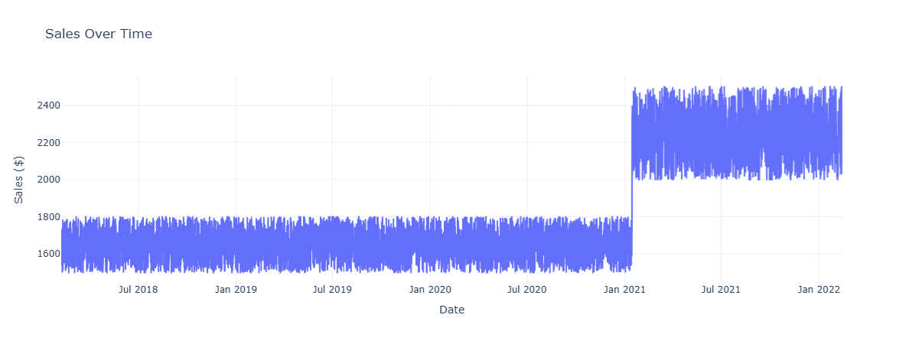

# Quantium starter repo
This repo contains everything you need to get started on the program! Good luck!

## Task 2: Data Cleaning 🧹

In this task, the raw sales data was cleaned to focus only on `Pink Morsels`. The steps included:

- Filtering data for the product "Pink Morsels"
- Converting dates to datetime format
- Ensuring the data was sorted by date
- Removing unnecessary columns or entries

The cleaned dataset was saved as `formatted_sales_data.csv`.

---

## Task 3: Sales Visualisation Using Dash 📊

This task involved creating a simple interactive dashboard using **Dash** to visualize the impact of a price change in Pink Morsels.

The line chart below shows how sales varied over time. A noticeable jump in sales is visible around the start of 2021 — indicating the price change.

### 📈 Output – Sales Line Chart



The dashboard was implemented in `dash_app.py`.

# 🧪 Quantum starter repo

## ✅ Task 4: Final Dash App with Callback and CSS

### Files
- `assets/styles.css`: Custom styling for the app.
- `data/`: Folder containing 3 CSV datasets.
- `formatted_sales_data.csv`: Cleaned and merged data used by the app.

### How to Run

```bash
python dash_app.py
